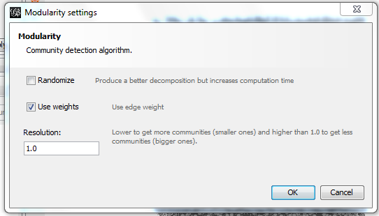
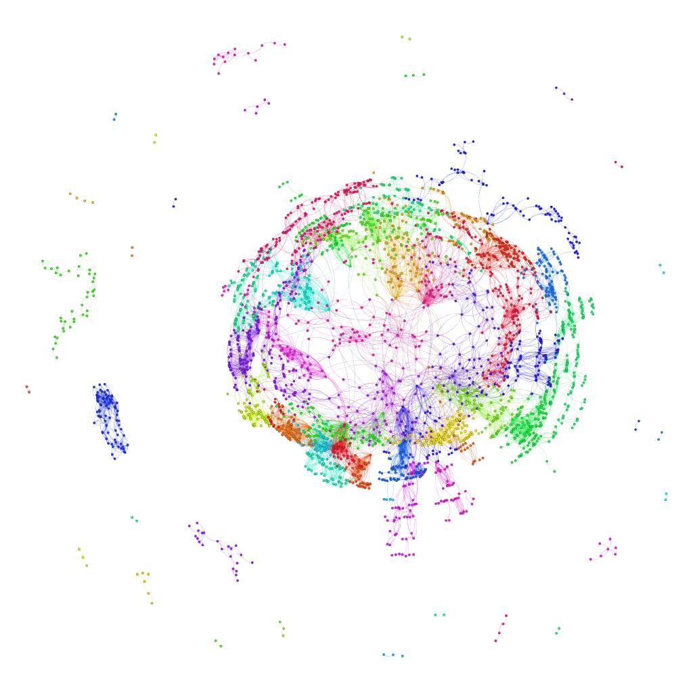

# U.S. Labor Market Network

## Introduction
This project examines U.S. worker flow data to identify labor markets.  Through the chosen methodology about 70 labor markets were discovered.

## Data Source
The [CTPP data product](http://ctpp.transportation.org/Pages/5-Year-Data.aspx) based on 2006 - 2010 5-year American Community Survey (ACS) Data was used in this project.  I made a custom download request of table A302100 - Total Workers (1) (Workers 16 years and over).  I selected all U.S. Counties as the RESIDENCE and WORKPLACE through the Beyond 2020 interface, and deselected the states (default setting).  Anyone can access the raw CTPP data through [the original download request](http://dataa.beyond2020.com/BulkDownload/BulkDownloadFiles/Job_4393.csv) or [my Google drive backup](https://googledrive.com/host/0B9jKAdYAFCl3bk9jODNteXhYbFk/Job_4393.csv).

## Data Manipulation
The raw data provided the nodes and edges for the analysis.  The number of workers were used as a weighting varaible for each edge.  The data was processed using Python.  I developed the script to filter out data based on three criteria:  
1.  The option to filter if the node loops back on itself;  
2.  If the number of workers (edge weight) was under a threshold;  
3.  If the data was too unreliable (meaning the margin of error to estimate ratio over a threshold).  

Through a trial and error process [I settled on parameters](https://raw.githubusercontent.com/mikeasilva/us-labor-market-network/master/Create%20U.S.%20Labor%20Market%20Graph.py) for the three criteria that left data for 94% of the counties in the orignal set and 5% of the edges.  I used the NetworkX library to create the graph and then exported it as a [graphml file](https://raw.githubusercontent.com/mikeasilva/us-labor-market-network/master/U.S.%20Labor%20Market.graphml). 

## Network Clustering
I used Gephi to analyze the graph and discover the clusters.  I used the modularity community detection algorithm.  To make the results reproducable I unchecked the "Randomize" option but left all other options with their default settings as shown here:

## Preliminary Results
This resulted in 71 communities being discovered.

These results were quickly examined in [R](https://raw.githubusercontent.com/mikeasilva/us-labor-market-network/master/Maps.Rmd) and for the most part I am happy with the findings.  *Note: In order to reproduce these results you must download the [us.geojson](https://raw.githubusercontent.com/hrbrmstr/rd3albers/master/data/us.geojson) file.*

### Classification Model
Since not every county is classified I developed a model that determined the classification as a function of latitude and longitude.  This model used 5 classification algorithms and then used a majority rule to come up with the final classification.  I also decided to name the area after the city with the largest population in the area.  The model's output was explored using [R](https://raw.githubusercontent.com/mikeasilva/us-labor-market-network/master/U.S.%20Labor%20Market%20Model%20Map.Rmd) which can be seen below:

There is a problem with the above visualization in that there are two areas that share the same color.